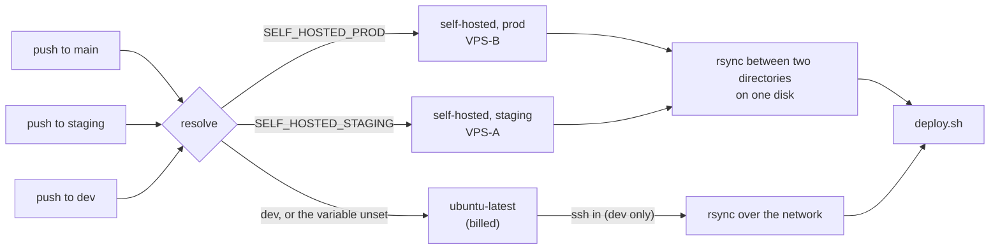
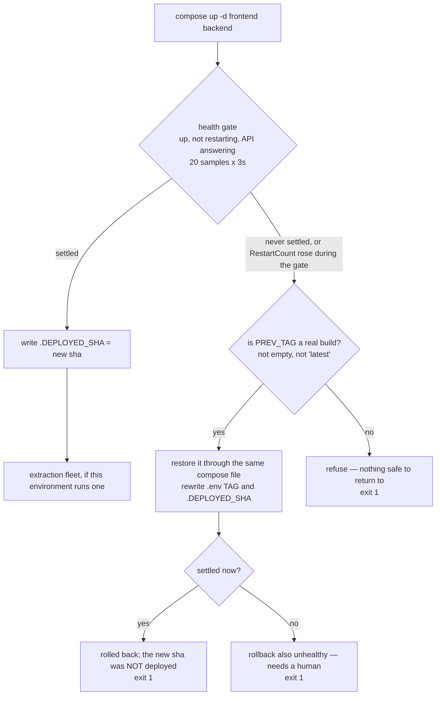

# Self-hosted deploy runners

`prod` and `staging` deploy **from the box they deploy to**. A runner installed on VPS-B
and VPS-A picks the deploy job up, and the deploy becomes a local operation: an rsync
between two directories on one disk, then `deploy/deploy.sh`. GitHub never opens a
connection into either machine.

**All four Deploy jobs** — `resolve`, `selfcheck`, `build`, `deploy` — run there, so a
push to `main` or `staging` consumes no GitHub-hosted minutes at all. `build` producing
the images on the box that will run them is also what keeps the environments apart: a
staging build never touches VPS-B. Both boxes are `x86_64`, the architecture
`ubuntu-latest` was already producing, so the images themselves are unchanged.

`dev` has no runner and still deploys over ssh from a GitHub-hosted machine. Both paths
live in `deploy.yml` side by side, selected by `runner.environment`.

**`ci.yml` runs on the staging runner too**, since 2026-09-08 — it was the last workflow
on `ubuntu-latest`, and once the account hit its spending limit every push ended in *"the
job was not started"*, so the schema diff and the backend and layout gates ran on no
commit at all. It does take a `pull_request` trigger, which `deploy.yml` deliberately does
not, so it goes self-hosted only when **all three** of these hold — see the trust boundary
below. It borrows staging's runner and is never offered prod's.

## What actually happens

Which machine picks a run up:



`resolve` is a job like any other, so it cannot read its own output — the branch-to-runner
mapping is therefore written twice, in its `runs-on` and in the shell that publishes it.
`deploy/test_runner_paths.py` asserts the two agree; drift between them puts `resolve` on a
GitHub runner while everything downstream waits on a self-hosted one.

And what `deploy.sh` does once it is there — the half no workflow graph can show, because
it happens inside one step on the box:



Every path that changes what is running also writes `.DEPLOYED_SHA`, which is why the
marker cannot name a build that is not up. It named one until 2026-09-07, when a rollback
drill on staging found `deploy.sh` writing it *before* the swap.

### One job at a time

A runner process runs a single job. `selfcheck` and `build`'s three matrix legs, which
used to run in parallel on four GitHub machines, now serialise on one box — a Deploy run
goes from roughly 7 minutes to roughly 12. There is no deadlock: the jobs form a DAG and
each finishes before the next starts. If that ever matters, install a second runner
instance on the same box with the same labels; nothing in the workflow changes.

## Why

**Cost.** Actions minutes are billed on private repositories. Measured 2026-09-01..07:
366 runs, ~2,100 billable minutes in seven days — a 9,000 min/month pace against a
2,000 min Free allowance, 4.5× over. Self-hosted minutes are not billed at all.

**Inbound ssh was the single largest source of deploy failures.** Every staging deploy
from 2026-09-06 14:28 onward failed at the reachability probe
(`kex_exchange_identification: Connection reset by peer`), and a production deploy failed
the same morning with `Connection timed out` after two retries — the provider's edge does
not admit every GitHub runner IP every time. The runner dials **out** to GitHub on 443 and
long-polls, the same direction as `git push`, so none of that applies any more.

## Install

One command per box, run **as root on that box**. Mint the token at
`Settings → Actions → Runners → New self-hosted runner`; it is valid for one hour and one
registration, and it is not a PAT — it cannot read the repository.

Two phases, because only one of them needs the token:

```
deploy/install-runner.sh staging --prepare               # no token; do this any time
RUNNER_TOKEN=AXXXX... deploy/install-runner.sh staging   # seconds; token is live 1 hour
```

`--prepare` runs the environment guard, checks every prerequisite a deploy actually uses
(docker, `docker compose` v2, rsync, git, a readable `/opt/kssl/app/.env`, a writable
`/opt/kssl/app`, outbound reachability to api.github.com and ghcr.io), installs the
runner's dependencies, unpacks it and proves the workspace is writable. It registers
nothing, starts nothing and installs no service. Registration then takes seconds, which
matters: a registration token is valid for **one hour**.

The token is passed in the environment and never written to a file, so it cannot reach
git. The script refuses to register a machine whose `/opt/kssl/app/.KSSL_ENV` marker
disagrees with the label you asked for — see the guards below.

It installs under `/opt/actions-runner`, registers with labels `self-hosted,<env>`,
installs the systemd service, then writes a drop-in **before the first start** carrying
two things the shipped unit does not have:

- `Restart=always` / `RestartSec=10` — `bin/actions.runner.service.template` has **no
  `Restart=` line at all**, so without this a runner whose process dies stays dead, and
  the environment it serves queues its next deploy for 24 hours.
- `Environment=RUNNER_ALLOW_RUNASROOT=1` — `run-helper.sh` refuses to start as root
  without it, and the generated unit sets no `Environment=`. Exporting it for `config.sh`
  is not enough; that shell is gone by the time systemd starts the service.

It then asserts `systemctl is-enabled`, because "it started" and "it survives a reboot"
are different claims.

Verify: the runner shows **Idle** at `…/settings/actions/runners`, and
`systemctl status actions.runner.*` is active on the box.

## Arming an environment (do this in order)

Merging the workflow change does **not** switch anything over, on purpose. A job asking
for `[self-hosted, prod]` when no such runner exists does not fail — it queues for up to
24 hours, looking exactly like a slow deploy. So each environment is armed by its own repo
variable, the same way `DEPLOY_ENABLED` gates production:

| variable | when to set it to `true` |
|---|---|
| `SELF_HOSTED_STAGING` | after the VPS-A runner reads **Idle** |
| `SELF_HOSTED_PROD` | after a staging deploy has actually completed on the runner |
| `SELF_HOSTED_CI` | after both of the above; `ci.yml` only ever uses the staging runner |

Unset — or anything other than `true` — keeps the ssh path. That is also the kill switch:
a runner that is uninstalled, unreachable or mid-rebuild is one variable away from being
routed around, with no revert and no redeploy.

The order that keeps a working path at every step:

1. **Register VPS-A.** `RUNNER_TOKEN=… /root/install-runner.sh staging`, then confirm
   `systemctl is-active` **and** `is-enabled` on the box, and that it reads **Idle** in
   Settings → Actions → Runners with labels `self-hosted, staging`.
2. **Arm staging only.** Set `SELF_HOSTED_STAGING=true`. Leave `SELF_HOSTED_PROD` unset.
3. **Deploy staging** — push to `staging`, or dispatch it. Then prove from the log:
   - all four jobs name the `kssl-staging` runner in their headers;
   - `Sync source + recreate frontend/backend (local)` ran;
   - the two ssh steps were **skipped**;
   - the marker line reads `marker 'staging' — ok for a staging deploy`;
   - the GHCR pull succeeded and the health gate passed;
   - `docker inspect -f '{{.Config.Image}}' kssl-stg-{frontend,backend}` both end in the
     deployed SHA.
4. **Register VPS-B and arm prod** — only after step 3 passes. `DEPLOY_ENABLED` still
   gates production independently; it is not replaced by these variables.
5. **Deploy prod once, controlled.** Same six checks against `kssl-{frontend,backend}`,
   plus `/` and `/ops/` still answering 200.

Until step 2, nothing changes: with both variables unset every job resolves to
`ubuntu-latest` and takes the ssh path. All three variables have been `true` since
2026-09-08; `dev` is the only environment still deploying over ssh, and it has no runner.

## Reading a run

Three views, none of which needs anything installed.

**The job graph**, on the run page. `needs:` renders as a DAG, so `resolve → selfcheck →
build x3 → deploy` *is* the first diagram above, drawn per run. Open `resolve` and its log
names both the labels it picked and the box that answered.

**Settings → Actions → Runners** — live `Idle`/`Active` per box. Look here first when a run
sits in `queued`: a job asking for labels no runner carries queues for 24 hours rather than
failing, which looks exactly like a slow deploy.

**The run summary.** `deploy.sh` writes a table to `$GITHUB_STEP_SUMMARY`, which the runner
renders at the top of the run page — the four facts that were previously only recoverable
by expanding a step and reading a few hundred lines of compose output:

```
### staging deploy — `da18318`

| runner          | `kssl-staging`                          |
| environment     | staging · prefix `kssl-stg`             |
| previous image  | `13b73d8`                               |
| health gate     | pass — settled on sample 3 of 20        |
| rollback        | none                                    |
| `.DEPLOYED_SHA` | `13b73d8` → `da18318`                   |
| run by          | GitHub Actions                          |
```

It is written from an `EXIT` trap, because `healthgate.sh` calls `exit 1` — the run that
most needs a summary is the one where nothing after the gate executes. On a rejected
deploy the same table reads `FAIL — backend restarted 3x during the gate` and
`rollback | restored 3f875de`, and the marker row shows it did not move.

The variable exists only inside an Actions job, so the `dev` ssh path and a hand-run
recovery write nothing and are otherwise untouched. A hand-run deploy that *is* inside
Actions is marked **by hand** in the last row.

## Three guards against deploying to the wrong environment

They are layered on purpose; each catches what the one before it cannot.

| # | Where | What it checks |
|---|---|---|
| 1 | `install-runner.sh` | Refuses to register unless `/opt/kssl/app/.KSSL_ENV` equals the requested label. A mislabelled runner cannot be created in the first place. |
| 2 | `runs-on: [self-hosted, prod]` | GitHub only offers the job to a runner registered with **both** labels, so the staging runner is never eligible for a prod job. |
| 3 | "This runner must be the environment being deployed" | Reads the marker on the machine **before the rsync**. Catches a runner mislabelled by hand. |

`deploy.sh` checks the marker a fourth time, but by then the tree has already been
written — which is why guard 3 exists as a separate step rather than being left to it.

## Trust boundary — read this before adding a runner anywhere else

**Anyone who can push to `main`, `staging` or `dev` can execute code as root on that
box.** That is the whole security model, and it is acceptable here only because
`deploy.yml` fires exclusively on `push` to those branches and on `workflow_dispatch`,
both of which require write access to the repository.

- **`ci.yml` has a `pull_request` trigger, so it carries three tripwires.** It goes to
  `[self-hosted, staging]` only when `SELF_HOSTED_CI` is `true` **and**
  `github.event.repository.private` **and** the pull request's head repository is this one
  rather than a fork. Fail any and it falls back to `ubuntu-latest`. The private check is
  read off the event payload rather than a variable on purpose: making this repository
  public disarms it immediately, with nobody having to remember. All three are asserted,
  in both places they are written, by `deploy/test_runner_paths.py`.
- **Never add a `pull_request` trigger to `deploy.yml`.** No tripwire would make that
  safe — a deploy job is root on the box by design, and that file is also asserted to be
  push-only.
- **The runner runs as root, deliberately.** `deploy.sh` drives `docker compose`, which
  reads `/opt/kssl/app/.env` (`root:root 600`), and writes `/opt/kssl/app`. That is what
  the ssh path already did as `root@`, so this is parity rather than escalation. A
  non-root user in the `docker` group would not be an improvement: `docker run -v /:/host`
  is root with extra steps.
- **If this repository ever becomes public, remove the runners first.**

## Rolling back to ssh

Change the `runner=` line for that environment in `deploy.yml`'s `resolve` job back to
`["ubuntu-latest"]`. The ssh steps take over on the next run with nothing else changed;
they are still in the file and still the only path for `dev`. Nothing needs to be
uninstalled from the box.

## Removing a runner

```
cd /opt/actions-runner && ./svc.sh stop && ./svc.sh uninstall
./config.sh remove --token <a fresh removal token>
```

## When a runner is unavailable

Two different failures, and only one of them is bounded.

**Runner never armed** — `SELF_HOSTED_*` unset. The job goes to `ubuntu-latest` over ssh.
This is the default, and the reason the variable exists: nothing can queue for a runner
the workflow was never told to ask for.

**Runner armed but offline** (box down, service dead, mid-rebuild). The job **queues for
up to 24 hours**. GitHub bounds queue time at 24h globally and offers no per-job setting
to shorten it, so `timeout-minutes` does not help — that clock only starts when a runner
picks the job up. There is no fix inside the workflow.

The control is therefore operational, and it is one click:

> Set `SELF_HOSTED_PROD` / `SELF_HOSTED_STAGING` to anything but `true`, then re-run.
> The next run takes the ssh path immediately. Cancel the queued run.

So the thing to watch is the runner's health, not the queue. Check
`systemctl is-active actions.runner.*` on the box, or that it reads **Idle** in
Settings → Actions → Runners. A runner offline for more than a few minutes should be
un-armed rather than waited on.

## Operational notes

- **A box that is down is a pipeline that is down** for its environment. It fails closed:
  the job queues rather than deploying something wrong.
- **Build cache grows.** `docker builder prune -f` monthly, or the disk creeps.
- **The workspace persists** at `/opt/actions-runner/_work`. `actions/checkout` cleans it
  each run (`git clean -ffdx`), so a stale tree is not a failure mode, but it does hold a
  full checkout permanently.
- **Survives reboot.** `svc.sh install` enables the unit, and the installer adds a
  `Restart=always / RestartSec=10` drop-in. Verify BOTH after installing — "it started"
  and "it comes back after a reboot" are different claims:
  `systemctl is-enabled actions.runner.*` and `systemctl is-active actions.runner.*`.
- **Two runners, one repository.** They are independent; neither can take the other's
  jobs, because the labels do not overlap.
